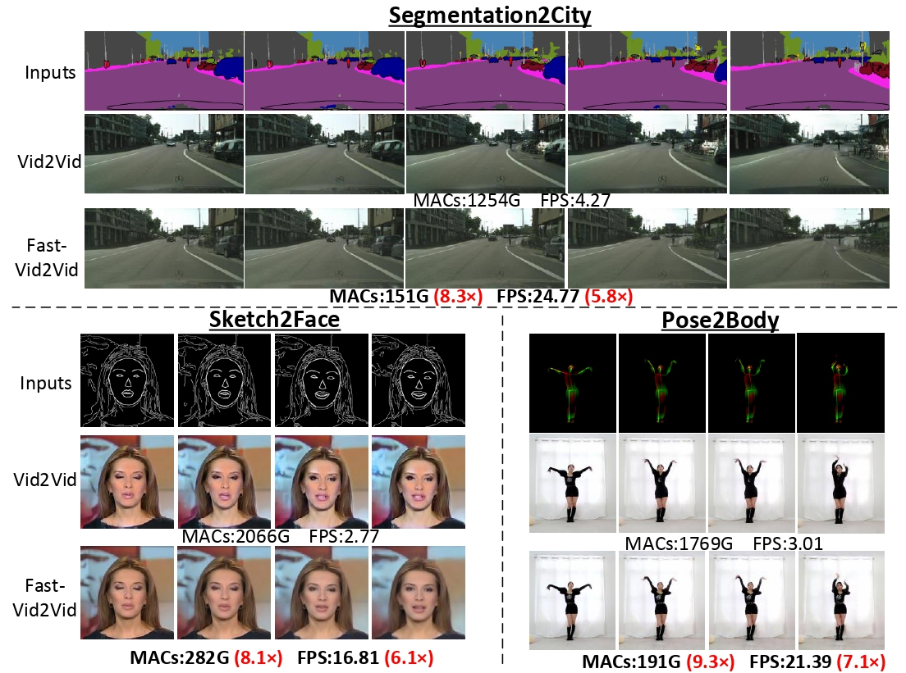
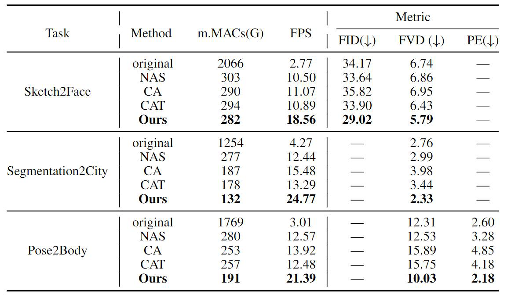

# Fast-Vid2Vid: Spatial-Temporal Compression for Video-to-Video Synthesis  

### [Project](https://fast-vid2vid.github.io/) | [YouTube](https://youtu.be/AhEqjGVuk4A) | [arXiv](https://arxiv.org/pdf/2207.05049.pdf) 




>**Abstract:** Video-to-Video synthesis (Vid2Vid) has achieved remarkable results in generating a photo-realistic video from a sequence of semantic maps. However, this pipeline suffers from high computational cost and long inference latency, which largely depends on two essential factors: 1) network architecture parameters, 2) sequential data stream. Recently, the parameters of image-based generative models have been significantly compressed via more efficient network architectures. Nevertheless, existing methods mainly focus on slimming network architectures and ignore the size of the sequential data stream. Moreover, due to the lack of temporal coherence, image-based compression is not sufficient for the compression of the video task. In this paper, we present a spatial-temporal compression framework, Fast-Vid2Vid, which focuses on data aspects of generative models. It makes the first attempt at time dimension to reduce computational resources and accelerate inference. Specifically, we compress the input data stream spatially and reduce the temporal redundancy. After the proposed spatial-temporal knowledge distillation, our model can synthesize key-frames using the low-resolution data stream. Finally, Fast-Vid2Vid interpolates intermediate frames by motion compensation with slight latency. On standard benchmarks, Fast-Vid2Vid achieves around real-time performance as 20 FPS and saves around 8× computational cost on a single V100 GPU.

 [Long Zhuo](mailto:zhuolong@pjlab.org.cn)<sup>1</sup>, [Guangcong Wang](https://wanggcong.github.io/)<sup>2</sup>, [Shikai Li](mailto:lishikai@sensetime.com)<sup>3</sup>, [Wayne Wu](https://wywu.github.io/)<sup>1,3</sup>, [Ziwei Liu](https://liuziwei7.github.io/)<sup>2</sup>  
 <sup>1</sup>Shanghai AI Laboratory, <sup>2</sup>S-Lab, Nanyang Technological University,  <sup>3</sup>SenseTime Research

 In **European Conference on Computer Vision (ECCV)**, 2022  

### Fast Video-to-Video Translation

<p align='center'>  
    
</p>

### Peformance

<p align='left'>  
    
</p>

## Prerequisites
- Linux or macOS
- Python 3
- NVIDIA GPU + CUDA cuDNN
- PyTorch >= 1.0
- ffmpeg toolbox >= 4.0
- OpenCV

## Getting Started

### Inference Enviroment
We recommend using the virtual environment (conda) to run the code easily.

```
conda create -n fvid python=3.7;
conda activate fvid;
conda install pytorch==1.7.1 torchvision==0.8.2 cudatoolkit=10.1;
conda install ffmpeg==4.0.2;
pip install opencv-python dominate scipy tqdm matplotlib scikit-image;
```

### Download examples
- Please first download the example ``datasets`` from [this link](https://drive.google.com/file/d/1Jl_R87bfzPjDkWa-5_duhssppIRw1x2C/view?usp=sharing).


### Download pretrained models 
- Face 
  - Download the pretrained model from [this link](https://drive.google.com/file/d/1rqZfQ5X1zVLvObqzJZFCG5tFMPGGHu9u/view?usp=sharing) and unzip it in ``checkpoints`` folder.
  - To test the model. 
    ```
    bash scripts/face/test.sh
    ```

- Cityscapes  
  -  Download the pretrained model from [this link](https://drive.google.com/file/d/1GE0tmHR6jmXl0YEaY_rD9TkRCAVafHio/view?usp=sharing) and unzip it in ``checkpoints`` folder.
  - To test the model. 
    ```
    bash scripts/street/test.sh
    ```

## Training 

### Installation

Please first install [FlowNet2](https://github.com/NVIDIA/flownet2-pytorch) into ``models/flownet2_pytorch/``.


### Dataset
- Cityscapes
  - Please download the full-size dataset (~300 GB) from the [official website](https://www.cityscapes-dataset.com/).
  - We pre-pocess the corresponding semantic maps (A) and instance maps (Inst) by well-trained models.
- Face
  - We adopt the [FaceForensics](http://niessnerlab.org/projects/roessler2018faceforensics.html) dataset. The keypoints of each frame are generated by landmark detection. We then interpolate the keypoints to get face edges.
- Pose
  - We use dancing videos on YouTube following vid2vid. We then apply DensePose and OpenPose to estimate the poses for each frame. Due to the pravicy issues, we do not release the pretrained model for Pose2Body, which is kept the same as vid2vid.

### Training with Face Dataset

- Pre-train the teacher model.
  ```
  bash scripts/face/train_teacher.sh
  ```
- Train the spatially low-demand generator with spatial knowledge distillation.
  ```
  bash scripts/face/train_skd.sh
  ```

- Train the part-time student generator with temporal knowledge distillation.

  ```
  bash scripts/face/train_tkd.sh
  ```

### Training with Cityscapes Dataset

- Pre-train the teacher model.
  ```
  bash scripts/street/train_teacher.sh
  ```
- Train the spatially low-demand generator with spatial knowledge distillation.
  ```
  bash scripts/street/train_skd.sh
  ```

- Train the part-time student generator with temporal knowledge distillation.

  ```
  bash scripts/street/train_tkd.sh
  ```

- Note that the resolution of our training data is 256 × 512, as we only use the first-scale generator. If needed, one can use the original vid2vid's coarse-to-fine manner for higher resolution. For example, firstly, one needs to train a 1024× (or higher resolution) teacher model. Then, the network structures of the refined network are needed to be converted to a spatially low-demand network (refer to `netorks.py`). Next, train the network with spatial-temporal knowledge distillation.
  - (Optional) The knowledge distillation may be used from the first-scale network.


## Citation

If you find this useful for your research, please cite the our paper.

```
@inproceedings{zhuo2022fast,
   author    = {Zhuo, Long and Wang, Guangcong and Li, Shikai and Wu, Wanye and Liu, Ziwei},
   title     = {Fast-Vid2Vid: Spatial-Temporal Compression for Video-to-Video Synthesis},
   booktitle = {European Conference on Computer Vision (ECCV)},   
   year      = {2022},
}
```

## Acknowledgments
This code is based on the [Vid2Vid](https://github.com/NVIDIA/vid2vid) codebase. 

